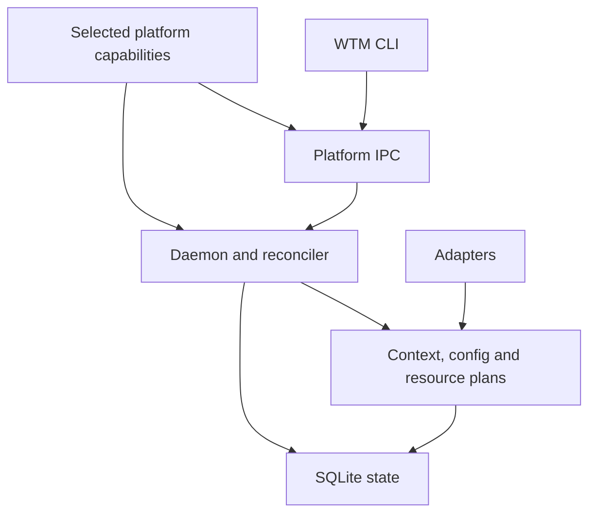

# Architecture

## High-level model



The platform is selected once at startup. macOS uses launchd and Unix sockets; Linux uses
the systemd user manager and Unix sockets. Windows has an experimental Scheduled Task and
named-pipe backend. Backend implementation, native acceptance and release distribution are
separate milestones; see [support status](../SUPPORT.md).

## Packages

The source repository should use a small Bun workspace with explicit package boundaries. Runtime packages remain compatible with Node.js 24 LTS; Bun is the development package manager, script runner and test runner.

```text
packages/
├── protocol/        # shared types, JSON schemas, error codes
├── platform/        # paths, process identity, IPC, file trust, service backends
├── core/            # config, Git model, planning, analysis, ownership
├── adapters/        # built-in adapter implementations
├── daemon/          # watcher, IPC server, service lifecycle, supervisor
├── cli/             # command parsing and human/JSON presentation
└── testkit/         # temporary Git repositories and fixture helpers

skills/
└── wtm/
    └── SKILL.md
```

The packages are separate because external adapter authors and agent integrations need stable contracts while daemon internals should remain replaceable.

## Core responsibilities

The core owns:

- workspace registration and scope;
- config inheritance and provenance;
- Git repository/worktree topology;
- stable identity allocation;
- worktree analysis;
- plan normalization;
- conflict detection;
- resource ownership;
- endpoint leases;
- task resolution;
- safe deletion policy;
- state transitions.

Core modules do not directly perform UI rendering and are not coupled to any one operating system. Composition roots select `@wtm/platform` capabilities and inject the required structural interfaces into core; core does not import that package. A structural test rejects platform-specific imports, literals and spawned commands in `core` or `protocol`, including their tests.

## Platform capabilities

`PlatformRuntime` exposes plain functional ports, with no platform inheritance hierarchy:

| Port | Responsibility |
| --- | --- |
| `paths` | Data, config, log, service and IPC roots |
| `socket` | Address limits and bound-address derivation |
| `ipc` | Safe server publication and cleanup for Unix sockets or named pipes |
| `process` | Process identity, presence and group/tree signaling |
| `fileTrust` | Current-user ownership, access policy and hard-link checks |
| `service` | Service definition, manager commands and status interpretation |

Filesystem analysis can also receive a bounded mount-boundary reader from the composition
root. Linux supplies mount-table evidence so reclaimable-byte estimates exclude same-device
bind mounts. Core interprets that evidence without reading a platform mount table itself.
Other platforms retain their existing device and symlink boundaries; this Linux capability
does not establish same-device mount exclusion on every operating system.

## Daemon responsibilities

The daemon owns:

- event-driven filesystem watching;
- scheduling reconciliations;
- the platform IPC server;
- persistent managed-process supervision;
- log redirection/rotation;
- service installation state (launchd, the systemd user manager or Scheduled Tasks);
- background cleanup retries.

The daemon never interprets a framework-specific lockfile itself; it calls the core/adapter layer.

## Shared finite-task queue

`wtm run <task> --enqueue` sends a configured finite task to the existing daemon. SQLite commits
the job before the CLI receives its identifier. A transaction claims the FIFO head and its
concurrency slot together; the default is one heavy task across every registered repository in
this state database. Jobs in the same worktree never hold slots together. A blocked FIFO head
deliberately holds back later jobs. Ordinary foreground `run` and background `start` retain
their separate execution paths.

Read-only waiting diagnostics use the same capacity/FIFO/worktree decision as atomic claims.
The scheduler reports `concurrency`, `worktree_busy`, `fifo`, `memory_budget`, or `dispatch_pending`; querying
does not reserve capacity. Terminal finalization rereads the durable stop reason inside its
SQLite transaction so cancellation accepted during asynchronous source validation cannot
be overwritten by an earlier success decision.

The queue uses the existing process anchor, managed-process store and log safety rules. The
job is bound to its process before the anchor receives GO. Task exit-code/signal evidence is
written by the anchor, including timeout information when the daemon is unavailable. Recovery
never retries a command with an uncertain outcome. A job keeps its slot until the complete
owned process group or tree is confirmed absent; neither a STOPPED label nor a cancellation request alone
proves that condition. Destructive repository leases and queued/running jobs exclude one
another in the same database transaction.

Final outcome selection follows owned-process absence and supervisor stop confirmation, then
a fresh completion read. An unreadable or invalid completion remains uncertain across polls
until an authenticated non-null record is read. Observed anchor success cannot override that
uncertainty. Once the group is absent, the job can release its slot as `INTERRUPTED` with
`COMPLETION_UNREADABLE`; cancellation and timeout retain their existing precedence. Recovery
does not replay this terminal job.

Queue state binds to a machine/user identity before managed process recovery. Subsequent use
of that database by another host or user is rejected; machines with a shared HOME must use
separate, host-local state. Legacy unscoped process records are adopted once under the existing
host-local-state assumption; migration cannot establish which host originally created them.
Cloned operating system images must have distinct machine identities. The queue scope is an
application-specific HMAC of these inputs; raw machine/user identifiers are not published:

| Platform | Machine identity | User identity | Reference |
| --- | --- | --- | --- |
| Linux | machine-id | UID | [systemd machine-id](https://www.freedesktop.org/software/systemd/man/249/machine-id.html) |
| macOS | IOPlatformUUID | UID | [Apple platform UUID key](https://developer.apple.com/documentation/iokit/kioplatformuuidkey) |
| Windows | SMBIOS system UUID | SID | [Microsoft system product UUID](https://learn.microsoft.com/en-us/windows/win32/cimwin32prov/win32-computersystemproduct) |

Optional global memory policy combines a task's positive `memory_estimate_mib`, a configured
budget, headroom reserved for other applications and an available-memory sample. The SQLite
claim reserves the full estimate alongside the concurrency slot and includes every held
reservation, even during uncertain cleanup. Unknown available-memory evidence defers admission. A legacy
held job with no estimate blocks new memory-aware admission until its cleanup is proved.
Task-specific `queue_env` can limit the task's own worker parallelism.

This remains cooperative estimated admission, not an operating-system memory quota. Distinct
state directories and direct terminal commands operate outside the shared limits; task workers
must fit the declared estimate. Available memory is sampled on admission/dispatch and explicit
status reads; no periodic host memory scanner is added. The queue wakes for admission/completion and checks
outstanding jobs at bounded intervals; an empty queue has no recurring scheduler timer.

Source evidence covers HEAD, index and Git-visible tracked/untracked content, including file
identity/time metadata. It is checked before launch, on completion and on result lookup. It
does not freeze sources or measure ignored/external dependencies. File, byte and elapsed-time
budgets fail closed; symlinks/submodules are refused. See the
[measurement procedure](development/2026-09-09-heavy-job-memory-measurement.md) for the separate
native two-session RAM experiment still required before claiming a saving.

## CLI responsibilities

The CLI is a thin client. For commands requiring daemon state it connects through the selected platform's IPC transport. If the daemon is unavailable, read-only diagnostic commands may run a local reconciliation.

The CLI owns:

- argument parsing;
- local-vs-global selector resolution;
- TTY formatting;
- `--json` serialization;
- exit codes;
- interactive confirmation only where explicitly designed.

Business rules must not be duplicated in CLI command handlers.

## Reconciliation model

Filesystem events are hints, not truth.

For worktree topology the authoritative query is:

```bash
git -C <repo> worktree list --porcelain -z
```

WTM compares the new snapshot with persisted state and produces transitions:

```text
known + present       -> update
unknown + present     -> discovered/created
known + absent        -> orphaned -> cleanup
```

This handles:

- worktrees created through raw Git;
- worktrees created through Codex/Claude/another application;
- daemon restarts;
- events that are coalesced;
- worktrees moved or repaired.

## Event filtering

A watched workspace can contain millions of source edits. WTM must not invoke adapter discovery for arbitrary source changes.

Structural triggers include:

- Git administrative changes;
- `wtm.toml` / `.wtm.toml`;
- recognized ecosystem marker/lock files;
- Makefile/task configuration files;
- Compose files.

Normal `src/**` edits are ignored by the orchestration layer.

## Adapter architecture

Adapters can be built in or external. They all produce declarative metadata and plans. External adapters are short-lived executables using JSON over stdin/stdout.

```text
metadata -> detect -> plan -> core apply
                         \
                          -> doctor
cleanup-plan -> core apply
```

The adapter proposes. Configuration and core safety rules decide.

## Runtime ownership

Every runtime resource belongs to an owner:

```text
worktree:<persistent-id>
```

Owned resources can include:

- endpoint/port leases;
- managed process groups or trees;
- Docker project namespace;
- temporary files;
- generated runtime env;
- logs;
- cleanup actions.

This ownership is the key to deterministic cleanup.

## Why TypeScript first

Node's native filesystem watcher provides the platform filesystem notifications; WTM keeps one structural watcher without a resident Rust/Swift helper. TypeScript also lowers contribution cost and keeps protocol/CLI types shared.

Rust is intentionally reserved for a measured performance problem, not used preemptively. A native helper can later replace a narrow interface such as watcher/process inspection without changing the core contract.

## Failure containment

- external adapter crash: adapter call fails; daemon remains alive;
- malformed adapter JSON: rejected by protocol schema;
- Git command failure: repository becomes degraded, other repositories continue;
- daemon crash: launchd's `KeepAlive` and systemd's `Restart=on-failure` provide restart policy; startup reconciliation repairs state whenever the daemon starts. Windows Scheduled Task recovery still needs native acceptance evidence;
- stale process record: identity verification prevents killing unrelated PIDs;
- unavailable Docker: cleanup remains pending and retries later;
- invalid config: affected workspace is degraded; other registered workspaces remain operational.
